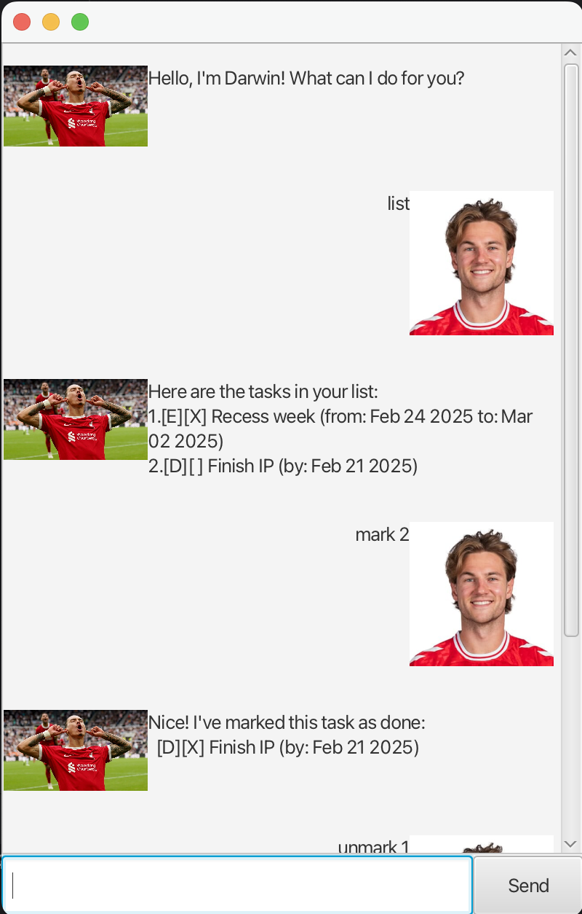

# Darwin User Guide



Darwin is a chatbot. That's it.

## Adding tasks: `todo`, `deadline`, `event`

Adds the task to the list.

Format: `todo DESCRIPTION`

Format: `deadline DESCRIPTION /by DEADLINE_DATE`

Format: `event DESCRIPTION /from START_DATE /to END_DATE`

// A description of the expected outcome goes here

```
expected output
```

## Marking tasks: `mark`

Marks the task at given task number as completed.

Format: `mark TASK_NUMBER`

- TASK_NUMBER must be a positive integer.

## Unmarking tasks: `unmark`

Unmarks the task at given task number.

Format `unmark TASK_NUMBER`

- TASK_NUMBER must be a positive integer.

## Deleting tasks: `delete`

Deletes the task at given task number.

Format: `delete TASK_NUMBER`

- TASK_NUMBER must be a positive integer.

## Finding tasks: `find`

Finds all tasks that contain the given keyword.

Format: `find KEYWORD`

- KEYWORD must be a string.
- KEYWORD is case-sensitive.

## Listing tasks: `list`

Lists all existing tasks.

Format: `list`

## Exit: `bye`

Exits Darwin chatbot.

Format: `bye`

Output:
```
Bye. Hope to see you again soon!
```